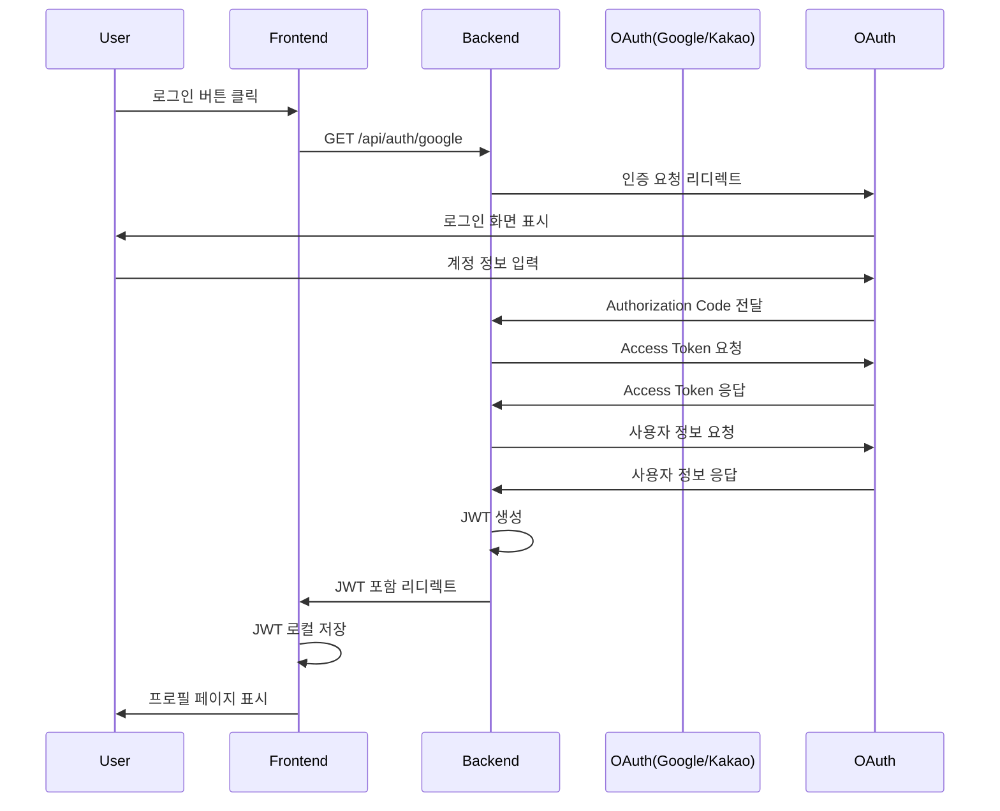

# 소셜 로그인 시스템 (OAuth A안)

tommy-common 모듈 기반 소셜 로그인 인증 시스템 프로토타입

## 📋 개요

Google, Kakao OAuth 2.0을 사용한 소셜 로그인 시스템입니다.
JWT 토큰 기반 인증을 제공하며, DB 없이 메모리 세션으로 동작합니다.

**주요 특징:**
- ✅ Google & Kakao 소셜 로그인
- ✅ JWT 토큰 인증 (7일 유효)
- ✅ 반응형 UI (Tailwind CSS)
- ✅ TypeScript 완전 지원
- ❌ DB 미사용 (메모리 세션)

---

## 🏗️ 프로젝트 구조

```
oauth-login/
├── backend/              # Express 백엔드 서버
│   ├── src/
│   │   ├── config/      # OAuth 설정, JWT 유틸
│   │   ├── middleware/  # 인증 미들웨어
│   │   ├── routes/      # API 라우터
│   │   └── server.ts    # 서버 진입점
│   ├── .env.example
│   └── package.json
│
├── frontend/             # React 프론트엔드
│   ├── src/
│   │   ├── components/  # UI 컴포넌트
│   │   ├── services/    # API 서비스
│   │   ├── App.tsx
│   │   └── main.tsx
│   ├── index.html
│   └── package.json
│
└── README.md
```

---

## 🚀 시작하기

### 사전 요구사항

- Node.js 18+
- npm 또는 yarn
- Google/Kakao OAuth 클라이언트 ID 및 Secret

### 1. OAuth 앱 등록

#### Google OAuth
1. [Google Cloud Console](https://console.cloud.google.com/) 접속
2. 프로젝트 생성 → "API 및 서비스" → "사용자 인증 정보"
3. OAuth 2.0 클라이언트 ID 생성
4. 승인된 리디렉션 URI: `http://localhost:3000/api/auth/google/callback`

#### Kakao OAuth
1. [Kakao Developers](https://developers.kakao.com/) 접속
2. 애플리케이션 추가 → "앱 설정" → "플랫폼"
3. Web 플랫폼 추가: `http://localhost:5173`
4. "제품 설정" → "카카오 로그인" → Redirect URI: `http://localhost:3000/api/auth/kakao/callback`

### 2. Backend 설정

```bash
cd backend
npm install

# 환경변수 설정
cp .env.example .env
# .env 파일에 OAuth 정보 입력
```

**`.env` 예시:**
```env
PORT=3000
FRONTEND_URL=http://localhost:5173
JWT_SECRET=your-super-secret-key

GOOGLE_CLIENT_ID=your-google-client-id
GOOGLE_CLIENT_SECRET=your-google-client-secret
GOOGLE_REDIRECT_URI=http://localhost:3000/api/auth/google/callback

KAKAO_CLIENT_ID=your-kakao-client-id
KAKAO_CLIENT_SECRET=your-kakao-client-secret
KAKAO_REDIRECT_URI=http://localhost:3000/api/auth/kakao/callback
```

### 3. Frontend 설정

```bash
cd frontend
npm install

# 환경변수 설정 (선택)
cp .env.example .env
```

**`.env` 예시:**
```env
VITE_API_URL=http://localhost:3000
```

### 4. 실행

**Backend 실행:**
```bash
cd backend
npm run dev
```

**Frontend 실행 (새 터미널):**
```bash
cd frontend
npm run dev
```

브라우저에서 `http://localhost:5173` 접속

---

## 📡 API 명세

### Authentication

| Method | Endpoint | 설명 |
|--------|----------|------|
| `GET` | `/api/auth/google` | Google 로그인 시작 |
| `GET` | `/api/auth/google/callback` | Google 콜백 (JWT 발급) |
| `GET` | `/api/auth/kakao` | Kakao 로그인 시작 |
| `GET` | `/api/auth/kakao/callback` | Kakao 콜백 (JWT 발급) |
| `GET` | `/api/auth/me` | 사용자 정보 조회 (JWT 필요) |
| `POST` | `/api/auth/logout` | 로그아웃 |

### 사용자 정보 조회 예시

```bash
curl -H "Authorization: Bearer YOUR_JWT_TOKEN" \
  http://localhost:3000/api/auth/me
```

**응답:**
```json
{
  "user": {
    "id": "123456789",
    "email": "user@example.com",
    "name": "홍길동",
    "picture": "https://...",
    "provider": "google"
  }
}
```

---

## 🔒 인증 플로우



---

## 🎨 화면 구성

### 1. 로그인 페이지 (`/`)
- Google, Kakao 로그인 버튼
- 반응형 카드 디자인

### 2. 프로필 페이지 (`/profile`)
- 사용자 정보 표시 (이름, 이메일, 프로필 사진)
- 로그인 플랫폼 표시
- 로그아웃 버튼

### 3. 콜백 페이지 (`/auth/callback`)
- OAuth 인증 후 JWT 처리
- 자동 프로필 페이지 이동

---

## 🛠️ 기술 스택

### Backend
- **Runtime:** Node.js + TypeScript
- **Framework:** Express
- **Auth:** JWT, OAuth 2.0
- **HTTP Client:** Axios

### Frontend
- **Framework:** React 18 + TypeScript
- **Routing:** React Router v6
- **Styling:** Tailwind CSS
- **Build Tool:** Vite
- **HTTP Client:** Axios

---

## 📦 주요 패키지

### Backend
```json
{
  "express": "^4.18.2",
  "jsonwebtoken": "^9.0.2",
  "axios": "^1.6.0",
  "dotenv": "^16.3.1",
  "cors": "^2.8.5"
}
```

### Frontend
```json
{
  "react": "^18.2.0",
  "react-router-dom": "^6.20.0",
  "axios": "^1.6.0",
  "tailwindcss": "^3.3.6"
}
```

---

## ⚠️ 제약사항

- ❌ **DB 미사용**: 서버 재시작 시 세션 초기화
- ❌ **프로덕션 부적합**: 개발/학습용 프로토타입
- ❌ **계정 연동 미지원**: 각 플랫폼 별도 관리
- ⚠️ **JWT Secret**: 프로덕션에서는 반드시 강력한 시크릿 사용

---

## 🔄 향후 확장 (B안)

- [ ] MongoDB/PostgreSQL 연동
- [ ] 사용자 정보 영구 저장
- [ ] 여러 소셜 계정 연동
- [ ] 프로필 수정 기능
- [ ] Refresh Token 구현
- [ ] Apple 로그인 지원

---

## 🐛 트러블슈팅

### 1. OAuth 리디렉트 실패
- `.env` 파일의 `REDIRECT_URI`가 OAuth 앱 설정과 일치하는지 확인
- Google/Kakao 개발자 콘솔에서 승인된 URI 목록 확인

### 2. CORS 에러
- Backend `server.ts`의 CORS 설정 확인
- Frontend URL이 `FRONTEND_URL`과 일치하는지 확인

### 3. JWT 토큰 만료
- 로그아웃 후 재로그인
- `JWT_SECRET` 변경 시 기존 토큰 무효화됨

---

## 📄 라이선스

MIT License

---

## 👨‍💻 개발자

tommy-common 모듈 활용 프로젝트

**문의:** [GitHub Issues](https://github.com/your-repo/issues)
